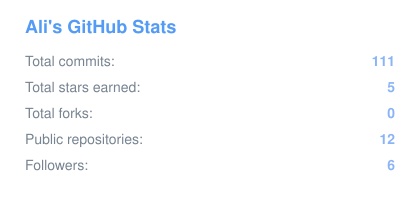
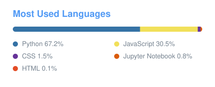
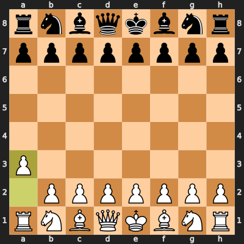

# Howdy!

I code to solve problems, create meaningful solutions, and sometimes even for fun (unbelievable, right?).
Programming enables my engineering side while also offering my creative side freedom.
I'm committed to building software that has a net positive on humanity, particularly in **AI/ML, aerospace, and networking**.

- Currently building data pipelines for satellite science and learning AI/ML engineering
- Growing into: AI/ML Engineering · Data Science & Engineering · DevOps/MLOps · AI Safety
- Active with [@acmuta](https://github.com/acmuta)
- More about me: [ali-jifi.com](https://www.ali-jifi.com)

## Tech Stack

**Languages**

**AI/ML & Data**

**Cloud & DevOps**

**Web & Databases**

## GitHub Stats

## Chess

<!-- CHESS-START -->
Anyone can play, just move for whichever side is up. It's currently **White's** turn. Pick a move below: it opens a pre-filled GitHub issue, and pressing **Create** makes your move. The board updates in about a minute.

| Piece | Available moves |
|-------|-----------------|
| ♖ a1 | [Ra2](https://github.com/ali-jifi/ali-jifi/issues/new?title=chess%7Cmove%7Ca1a2&body=Just+press+%2A%2ACreate%2A%2A+below+to+play+%2A%2ARa2%2A%2A.+A+GitHub+Action+will+make+your+move+on+%40ali-jifi%27s+profile+board+and+close+this+issue+automatically.+Thanks+for+playing%21) |
| ♙ a3 | [a4](https://github.com/ali-jifi/ali-jifi/issues/new?title=chess%7Cmove%7Ca3a4&body=Just+press+%2A%2ACreate%2A%2A+below+to+play+%2A%2Aa4%2A%2A.+A+GitHub+Action+will+make+your+move+on+%40ali-jifi%27s+profile+board+and+close+this+issue+automatically.+Thanks+for+playing%21) |
| ♘ b1 | [Nc3](https://github.com/ali-jifi/ali-jifi/issues/new?title=chess%7Cmove%7Cb1c3&body=Just+press+%2A%2ACreate%2A%2A+below+to+play+%2A%2ANc3%2A%2A.+A+GitHub+Action+will+make+your+move+on+%40ali-jifi%27s+profile+board+and+close+this+issue+automatically.+Thanks+for+playing%21) |
| ♙ b2 | [b3](https://github.com/ali-jifi/ali-jifi/issues/new?title=chess%7Cmove%7Cb2b3&body=Just+press+%2A%2ACreate%2A%2A+below+to+play+%2A%2Ab3%2A%2A.+A+GitHub+Action+will+make+your+move+on+%40ali-jifi%27s+profile+board+and+close+this+issue+automatically.+Thanks+for+playing%21) · [b4](https://github.com/ali-jifi/ali-jifi/issues/new?title=chess%7Cmove%7Cb2b4&body=Just+press+%2A%2ACreate%2A%2A+below+to+play+%2A%2Ab4%2A%2A.+A+GitHub+Action+will+make+your+move+on+%40ali-jifi%27s+profile+board+and+close+this+issue+automatically.+Thanks+for+playing%21) |
| ♙ c2 | [c3](https://github.com/ali-jifi/ali-jifi/issues/new?title=chess%7Cmove%7Cc2c3&body=Just+press+%2A%2ACreate%2A%2A+below+to+play+%2A%2Ac3%2A%2A.+A+GitHub+Action+will+make+your+move+on+%40ali-jifi%27s+profile+board+and+close+this+issue+automatically.+Thanks+for+playing%21) · [c4](https://github.com/ali-jifi/ali-jifi/issues/new?title=chess%7Cmove%7Cc2c4&body=Just+press+%2A%2ACreate%2A%2A+below+to+play+%2A%2Ac4%2A%2A.+A+GitHub+Action+will+make+your+move+on+%40ali-jifi%27s+profile+board+and+close+this+issue+automatically.+Thanks+for+playing%21) |
| ♙ d2 | [d3](https://github.com/ali-jifi/ali-jifi/issues/new?title=chess%7Cmove%7Cd2d3&body=Just+press+%2A%2ACreate%2A%2A+below+to+play+%2A%2Ad3%2A%2A.+A+GitHub+Action+will+make+your+move+on+%40ali-jifi%27s+profile+board+and+close+this+issue+automatically.+Thanks+for+playing%21) · [d4](https://github.com/ali-jifi/ali-jifi/issues/new?title=chess%7Cmove%7Cd2d4&body=Just+press+%2A%2ACreate%2A%2A+below+to+play+%2A%2Ad4%2A%2A.+A+GitHub+Action+will+make+your+move+on+%40ali-jifi%27s+profile+board+and+close+this+issue+automatically.+Thanks+for+playing%21) |
| ♙ e2 | [e3](https://github.com/ali-jifi/ali-jifi/issues/new?title=chess%7Cmove%7Ce2e3&body=Just+press+%2A%2ACreate%2A%2A+below+to+play+%2A%2Ae3%2A%2A.+A+GitHub+Action+will+make+your+move+on+%40ali-jifi%27s+profile+board+and+close+this+issue+automatically.+Thanks+for+playing%21) · [e4](https://github.com/ali-jifi/ali-jifi/issues/new?title=chess%7Cmove%7Ce2e4&body=Just+press+%2A%2ACreate%2A%2A+below+to+play+%2A%2Ae4%2A%2A.+A+GitHub+Action+will+make+your+move+on+%40ali-jifi%27s+profile+board+and+close+this+issue+automatically.+Thanks+for+playing%21) |
| ♙ f2 | [f3](https://github.com/ali-jifi/ali-jifi/issues/new?title=chess%7Cmove%7Cf2f3&body=Just+press+%2A%2ACreate%2A%2A+below+to+play+%2A%2Af3%2A%2A.+A+GitHub+Action+will+make+your+move+on+%40ali-jifi%27s+profile+board+and+close+this+issue+automatically.+Thanks+for+playing%21) · [f4](https://github.com/ali-jifi/ali-jifi/issues/new?title=chess%7Cmove%7Cf2f4&body=Just+press+%2A%2ACreate%2A%2A+below+to+play+%2A%2Af4%2A%2A.+A+GitHub+Action+will+make+your+move+on+%40ali-jifi%27s+profile+board+and+close+this+issue+automatically.+Thanks+for+playing%21) |
| ♘ g1 | [Nf3](https://github.com/ali-jifi/ali-jifi/issues/new?title=chess%7Cmove%7Cg1f3&body=Just+press+%2A%2ACreate%2A%2A+below+to+play+%2A%2ANf3%2A%2A.+A+GitHub+Action+will+make+your+move+on+%40ali-jifi%27s+profile+board+and+close+this+issue+automatically.+Thanks+for+playing%21) · [Nh3](https://github.com/ali-jifi/ali-jifi/issues/new?title=chess%7Cmove%7Cg1h3&body=Just+press+%2A%2ACreate%2A%2A+below+to+play+%2A%2ANh3%2A%2A.+A+GitHub+Action+will+make+your+move+on+%40ali-jifi%27s+profile+board+and+close+this+issue+automatically.+Thanks+for+playing%21) |
| ♙ g2 | [g3](https://github.com/ali-jifi/ali-jifi/issues/new?title=chess%7Cmove%7Cg2g3&body=Just+press+%2A%2ACreate%2A%2A+below+to+play+%2A%2Ag3%2A%2A.+A+GitHub+Action+will+make+your+move+on+%40ali-jifi%27s+profile+board+and+close+this+issue+automatically.+Thanks+for+playing%21) · [g4](https://github.com/ali-jifi/ali-jifi/issues/new?title=chess%7Cmove%7Cg2g4&body=Just+press+%2A%2ACreate%2A%2A+below+to+play+%2A%2Ag4%2A%2A.+A+GitHub+Action+will+make+your+move+on+%40ali-jifi%27s+profile+board+and+close+this+issue+automatically.+Thanks+for+playing%21) |
| ♙ h2 | [h3](https://github.com/ali-jifi/ali-jifi/issues/new?title=chess%7Cmove%7Ch2h3&body=Just+press+%2A%2ACreate%2A%2A+below+to+play+%2A%2Ah3%2A%2A.+A+GitHub+Action+will+make+your+move+on+%40ali-jifi%27s+profile+board+and+close+this+issue+automatically.+Thanks+for+playing%21) · [h4](https://github.com/ali-jifi/ali-jifi/issues/new?title=chess%7Cmove%7Ch2h4&body=Just+press+%2A%2ACreate%2A%2A+below+to+play+%2A%2Ah4%2A%2A.+A+GitHub+Action+will+make+your+move+on+%40ali-jifi%27s+profile+board+and+close+this+issue+automatically.+Thanks+for+playing%21) |

**Recent moves:** @ali-jifi (a3) → @ali-jifi (Nc6)

**Game #1** · Completed games: 0 (White 0 · Black 0 · Draws 0)
<!-- CHESS-END -->

## Socials

<!---
ali-jifi/ali-jifi is a ✨ special ✨ repository because its `README.md` (this file) appears on your GitHub profile.
You can click the Preview link to take a look at your changes.
--->
